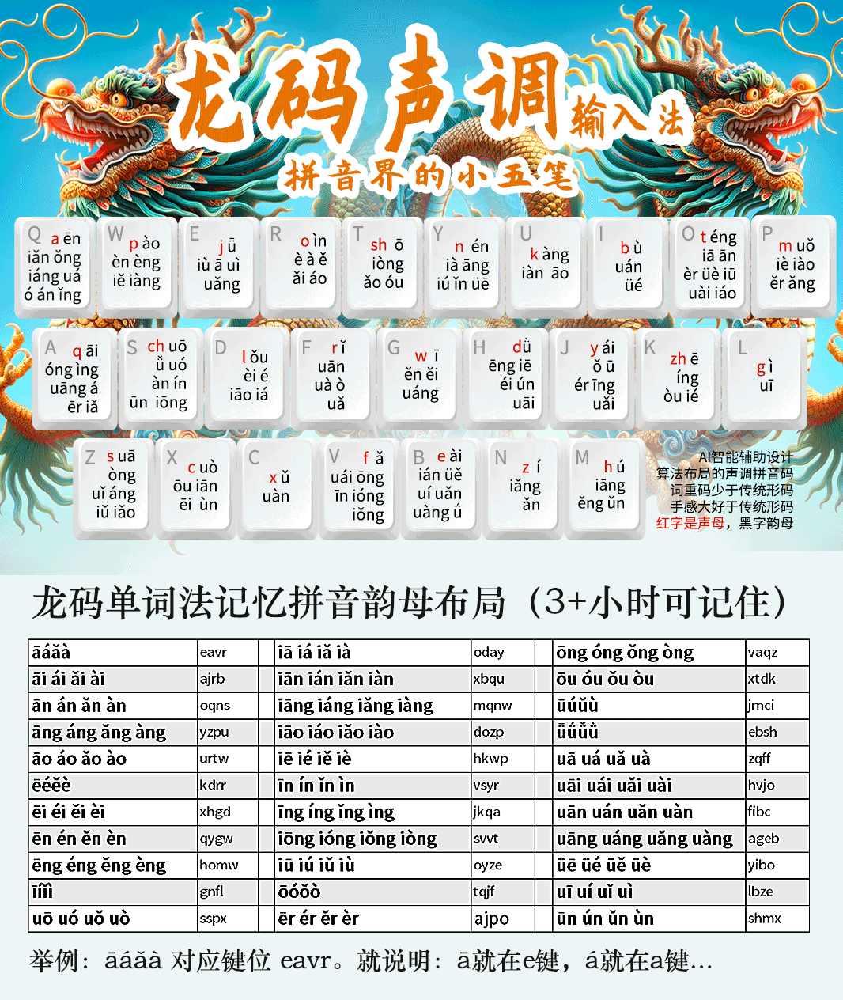

# ℞龙码万象输入法

原作者 晡时之光 [原始输入法页面见此](https://hanxinma.gitlab.io/longma)

龙码万象输入法，基于龙码方案并使用万象原子词库及万象语言模型，将带有音调的拼音拆分成声母及韵母音调两部分，分散于 26 键键盘上，每次输入两码，以此提高输入效率。

本方案仅使用原龙码输入法的音码部分，未使用形码辅助码。

## 注意

本方案本身依赖 [℞RIME-LMDG](https://github.com/amzxyz/RIME-LMDG) 。

## 零声母处理

与自然码类似方式处理，即第一位重复韵母第一个字符，第二位为韵母及音调本身。

因为该输入法输入韵母时会同时输入声调，因此不存在第二位为自然码同样的韵母第二位的情况。

## 键盘布局

新增按键见下：

| 拼音成份 | 按键（12345 声） |
|--------|----------------|
| 轻声 | 所有轻声的按键与其第一声相同 |
| 空韵母 m | PPPPP |
| 空韵母 n/ng | YYYYY |

